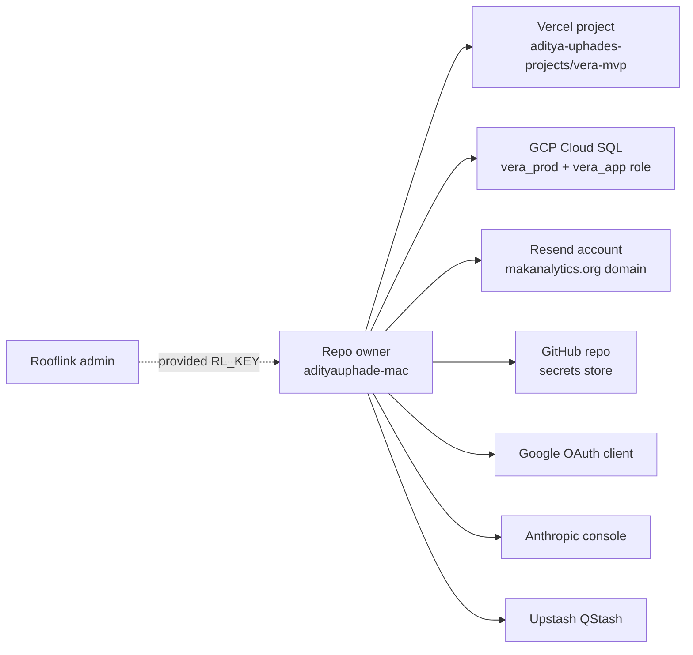

# Security

Where secrets live, who can access what, how to rotate, and what an
attacker would have to do to break in.

> Last updated: 2026-05-14

---

## Who can do what



Today there is **one human with full access** to the project: the GitHub
user `adityauphade-mac`. Every other surface authenticates back to that
identity. Adding a teammate means adding them at each surface
separately. Rooflink credentials (the `RL_KEY` we use to fetch data) are
provided by Israel and are not under our control.

---

## Where every secret lives

| Secret | Stored in | Used by | Rotation owner |
|---|---|---|---|
| `AUTH_SECRET` / `NEXTAUTH_SECRET` | Vercel env (Production) + `apps/web/.env.local` | Auth.js JWT encryption | repo owner |
| `GOOGLE_CLIENT_ID` + `GOOGLE_CLIENT_SECRET` | GCP project → Credentials | Google OAuth handshake | repo owner |
| `DATABASE_URL` + `DATABASE_URL_UNPOOLED` | Vercel env + `apps/web/.env.local` | Prisma client | repo owner |
| `vera_app` Postgres password | Inside the connection strings above; admin copy at `/tmp/vera_app_password.txt` on the migration machine | App's only DB role | repo owner |
| `postgres` admin password (GCP) | Israel provided once; never set on Vercel | One-off admin tasks from a laptop | Israel |
| `ANTHROPIC_API_KEY` | Vercel env + `.env.local` | Briefing generator + chat | repo owner |
| `NEWSAPI_KEY` | Vercel env + `.env.local` | News context for briefing | repo owner |
| `CRON_SECRET` | Vercel env + GitHub repo secret + `.env.local` | Bearer auth for `/api/cron/*` from GH Actions | repo owner |
| `QSTASH_CURRENT_SIGNING_KEY` + `QSTASH_NEXT_SIGNING_KEY` | Vercel env + `.env.local` | QStash signature verification | repo owner |
| `RESEND_API_KEY` | Vercel env + `.env.local` | Email sending | repo owner |
| `EMAIL_FROM` | Vercel env + `.env.local` | Verified Resend sender | repo owner |
| `RL_KEY` (Rooflink API token) | Vercel env + `.env.local` | Backfill fetcher | Israel |

**Three storage locations** for each secret in the worst case:
1. Vercel project env (the runtime source of truth)
2. The local `.env.local` (gitignored — for development)
3. For `CRON_SECRET` only: also a GitHub repo secret so workflows can authenticate

Keep the values in sync. Drift = production breaks silently.

---

## Rotation runbook

Generic recipe:

```bash
# 1. Generate a new value
openssl rand -hex 32    # for AUTH_SECRET, CRON_SECRET, etc.
# OR get a new value from the provider console (Resend, Anthropic, etc.)

# 2. Replace on Vercel
vercel env rm <NAME> production -y
echo "<new value>" | vercel env add <NAME> production

# 3. Replace in your local .env.local
$EDITOR apps/web/.env.local

# 4. For CRON_SECRET only: update the GitHub repo secret
gh secret set CRON_SECRET --body "<new value>"

# 5. Redeploy so the new value is live
vercel --prod --yes
```

### Specific cases

**`AUTH_SECRET`**: invalidates all active sessions. Users will need to
sign in again — JWT cookies signed with the old secret won't decrypt.

**`vera_app` DB password**: see the dedicated recipe in
[`OPERATIONS.md#rotate-the-vera_app-db-password`](OPERATIONS.md#rotate-the-vera_app-db-password) —
it requires updating both `DATABASE_URL` and `DATABASE_URL_UNPOOLED` and
running an `ALTER USER` against Cloud SQL as the admin role.

**`CRON_SECRET`**: must be updated **before** redeploying, or the next
cron tick fails 401. Update Vercel env, update GitHub secret, then deploy.

**`QSTASH_*_SIGNING_KEY`**: Upstash rotates these via the dashboard. The
two-key design (current + next) means rotation has a grace window —
update `QSTASH_NEXT_SIGNING_KEY` first, redeploy, then promote it to
`CURRENT` on the next rotation cycle.

**`RL_KEY`**: only Israel can rotate. Coordinate before changing.

---

## What's in the codebase vs out

| | In repo | In env |
|---|---|---|
| Connection strings | ❌ | ✓ (`DATABASE_URL`) |
| API keys | ❌ | ✓ (every `*_API_KEY`) |
| OAuth client IDs | ❌ | ✓ (`GOOGLE_CLIENT_ID`) |
| OAuth client secrets | ❌ | ✓ (`GOOGLE_CLIENT_SECRET`) |
| JWT signing keys | ❌ | ✓ (`AUTH_SECRET`) |
| Customer / tenant data | ❌ (only in DB) | n/a |
| `.env.local` | ❌ (gitignored) | n/a |

`.gitignore` lines that protect us:

```
.env
.env.local
.env.*.local
data/jobs_dedup.jsonl
apps/web/data/generated.json     # tracked actually — kept as JSON-path fallback
worktrees/                       # see .vercelignore too
.vercel
```

`.vercelignore` additionally excludes `worktrees/` from deploys — a
worktree's gitignored data files (notably the 196 MB
`data/jobs_dedup.jsonl`) once busted the Vercel 100 MB upload cap.

---

## Database access model

```
postgres (admin, Cloud SQL)
├── created vera_prod
├── created vera_app role
├── owns nothing in vera_prod
└── only used for admin tasks from a laptop

vera_app (application, Cloud SQL)
├── owns vera_prod and its public schema
├── full CRUD inside vera_prod
└── NO access to bap_dev, priority_crm_test_db, or any other DB on the instance
```

The instance is shared with other teams. Our row-level isolation is
"different role + different database name" — the strongest isolation
Cloud SQL offers short of separate instances.

**The app only ever connects as `vera_app`.** If a Vercel env var ever
shows `user=postgres` in `DATABASE_URL`, that's a misconfiguration —
rotate immediately and investigate.

### Authorized networks

Cloud SQL's "Authorized networks" allowlist is currently `0.0.0.0/0` —
any IP can attempt to connect. The actual auth surface is:

1. **SSL required.** Without `sslmode=require` in the connection string, Postgres rejects.
2. **Scoped role.** `vera_app` can only see `vera_prod`. Compromise gets one DB, not 5.
3. **42-char random password.** `openssl rand -base64 32 | tr -d '/+='` output. Not in source. Not in chat.

Tightening to specific Vercel IP ranges isn't practical because Vercel
serverless functions rotate IPs across a large pool. The tighter
alternative is the Cloud SQL Auth Proxy (would require a code change to
the app + ~30 min of plumbing); not warranted at MVP scale.

---

## OAuth scope policy

Auth.js v5 with Google provider. We request **only**:

- `openid`
- `email`
- `profile`

No Drive, Calendar, offline access, or other privileged scopes. The
`signIn` callback in `lib/auth.ts` runs once per user, creating their
`User` row and binding it to a tenant. After that the JWT lives in a
cookie; we never hit Google again until the next sign-in.

**Whitelist policy: open.** Any signed-in Google account is admitted on
first sign-in. Fine for V1 with one tenant; tighten to a domain rule
when going wider:

```ts
async signIn({ user }) {
  if (!user.email?.endsWith('@priorityroofs.com')) return false;
  // ...rest of the signIn logic
}
```

---

## What's PII / sensitive in the DB

| Table | Sensitive columns | Notes |
|---|---|---|
| `User` | `email`, `googleSub`, `imageUrl`, `name` | Standard Google profile fields |
| `Briefing` | `bodyMd`, `keyJobs.topCritical[].customerName`, `keyJobs.topCritical[].rep` | Contains customer + rep names + dollar amounts. Treat as confidential. |
| `Schedule` / `BackfillSchedule` | `recipient`, ops emails | Email addresses |
| `SendLog` | `toEmail`, `errorMessage`, `resendId` | Email addresses + Resend trace IDs |
| `AuditLog` | `details.before`, `details.after` snapshots; chat transcripts in `details.messages` | Carries before/after row contents for every audited mutation; chat queries are stored verbatim |
| `RawRooflinkJob` / `RawRooflinkLineItems` | `payload` JSONB | Full Rooflink payload per job/estimate — customer names, addresses, financial figures |

Read-only access to `vera_prod` exposes all of the above. Don't share
`DATABASE_URL` casually. If a teammate needs DB access:

- Create a `vera_readonly` role in Cloud SQL (`GRANT SELECT ON ALL TABLES IN SCHEMA public TO vera_readonly`)
- Generate a separate connection string for them
- Don't reuse the `vera_app` `DATABASE_URL`

---

## Attack surface — what works and what doesn't

| Attack | Why it fails today |
|---|---|
| Hit `/api/cron/dispatch-briefs` to fire schedules | Bearer-gated by `CRON_SECRET`. QStash-fired requests are JWT-signed via `QSTASH_*_SIGNING_KEY`. Without either → 401. |
| Hit `/api/jobs/aging` or any dashboard route to read tenant data | `withAuth` returns 401 without a valid Auth.js JWT cookie; query is then scoped to `session.user.tenantId` |
| Forge an Auth.js cookie | JWT signed with `AUTH_SECRET` (32 hex chars). Without the secret, can't sign valid tokens |
| Sign in with someone else's Google account | OAuth callback verifies Google's ID token signature; can't be spoofed |
| Read source for keys | All keys gitignored. Code only references `process.env.*` |
| Connect to `vera_prod` directly with the public IP | SSL required, then `vera_app` role + password required, then only `vera_prod` reachable. Cross-DB attack on the shared instance not possible from `vera_app`. |
| Read prod env via leaked deployment URL | Per-deploy hashed URLs are protected by Vercel Deployment Protection (require Vercel SSO). Canonical `vera-mvp.vercel.app` is public but doesn't expose env. |
| Inject a fake QStash tick | Verified by signature against rotating signing keys; can't be forged without the keys |

What still **could** go wrong:

- Compromise of the `adityauphade-mac` GitHub account → cascades into Vercel, GCP project, Resend, Anthropic, etc.
- Compromise of the Vercel team account → can read all prod env vars.
- Resend domain DNS compromise → attacker could send mail as `vera@makanalytics.org`.
- Cloud SQL admin password leak → cross-DB visibility on the shared instance.

Mitigations: 2FA on every surface; quarterly key rotation; audit
`gh secret list`, `vercel env ls`, and Resend's API-key page periodically;
keep the `vera_app` ↔ `postgres` privilege separation strict.

---

## Reporting a security issue

Don't open a public GitHub issue for security findings. Email the repo
owner directly (`adityauphade@makanalytics.org`) with details and a
proposed fix if you have one.
